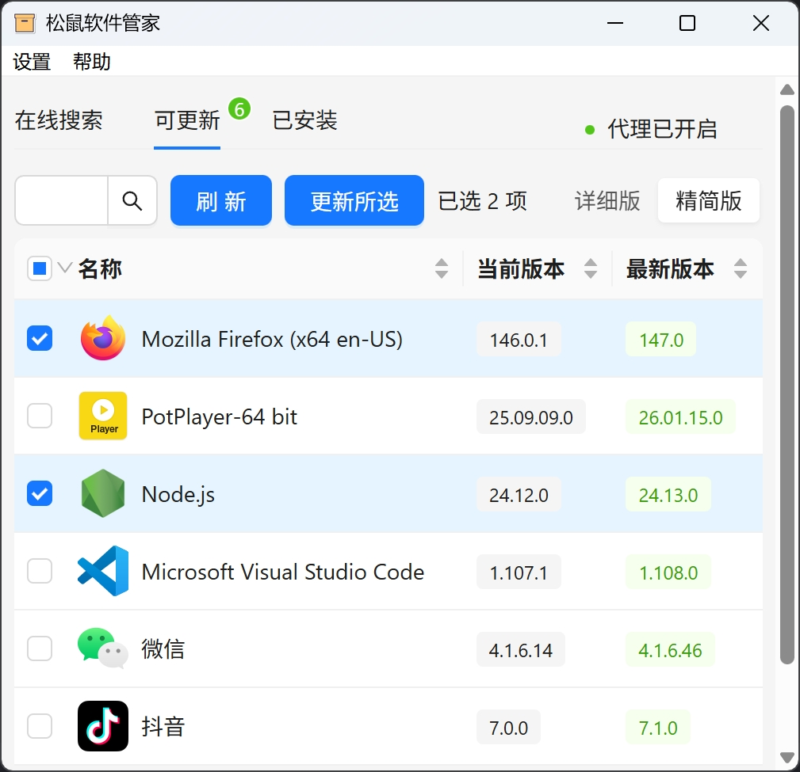

# 松鼠软件管家（guanManager）

可视化管理和更新软件，基于 WinGet



## ✨主要功能

- 在线搜索、下载、安装、更新软件
- 支持批量更新
- 支持启用代理

## 🧩系统要求

- Windows 10及以上
- 已安装 WinGet（一般系统会自带，也可[自行安装](https://github.com/microsoft/winget-cli/releases)）

## ⬇️下载

- GitHub Releases: https://github.com/CrankZ/guan-manager/releases

## 🚀开发

安装依赖

```bash
pnpm install
```

启动开发模式

```bash
pnpm tauri dev
```

构建

```bash
pnpm tauri build
```

## 🤔常见问题

### 安装 WinGet

一般 Windows 10 及以上的系统会自带 WinGet，但是如果未安装 WinGet，可以从这里下载并安装最新的 **.appxbundle** 文件。 https://github.com/microsoft/winget-cli/releases

### 搜不到某个软件

因为基于 WinGet，所以要求目标软件在 WinGet 有维护，如果没有维护，则搜不到
